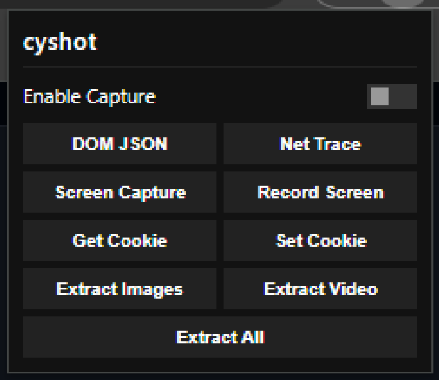
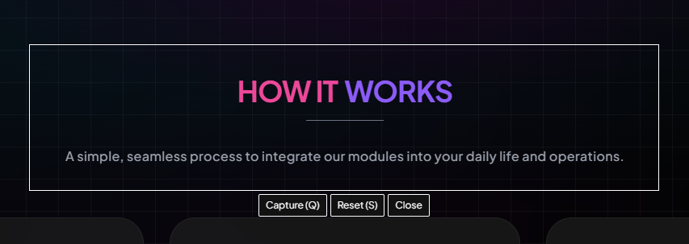

# cyshot

cyshot is a powerful, minimal, and flat Chrome Extension designed for web page extraction, screenshot captures, screen recording, network log tracing, and cookie/session state manipulation. Featuring a compact, brutalist flat design with zero rounded corners, cyshot provides web developers and security analysts with a clean, lightweight, and versatile tool for daily browser operations.

## Preview

| Extension Popup (Flat 2x Grid) | Crop Selection Overlay (Centred Panel) |
| :---: | :---: |
|  |  |

## Features

- **Flat & Compact Design:** A custom visual theme with sharp 90-degree corners, flat layout grids, and space-saving UI dimensions.
- **Interactive Screenshot Crop Overlay:**
  - Activate the **Enable Capture** toggle to draw custom screenshot regions.
  - Interactive on-screen toolbar containing **Capture (Q)**, **Reset (S)**, and **Close** buttons.
  - Supported with keyboard shortcuts: press `Q` to capture or `S` to clear/reset the active selection.
- **Visible Viewport Capture:** Capture the current visible area of the tab instantly as a high-quality PNG.
- **In-Tab Screen Recorder:** Start full screen-sharing video and audio capture right from the extension and download it as a WebM file.
- **DOM structure JSON Export:** Analyze page weight and canvas usage, extracting the full raw DOM structure into a structured JSON file.
- **Net Trace (XHR/Fetch Log):** Intercepts dynamic API requests, logging methods, urls, response payloads, status codes, and latency in milliseconds.
- **Cookie Export & Import:** Seamlessly download current site cookies as JSON, or inject cookies from a file to import active session states.
- **Media Assets Extractor:** Scan and compile all page images, videos, or external anchor links into sorted lists.

## Filename Naming Scheme

All files generated by cyshot are automatically saved using a clean, compact, and collision-free filename format:

```text
cyshot{type}_{domain}_{date}_{random_4_chars}.{ext}
```

* **Types:** `cookie` (Cookies), `dom` (DOM JSON), `net` (Net Trace), `cap` (Screenshot Capture), `vid` (Screen Recording), `img` (Extracted Images), `video` (Extracted Videos), `all` (All Links).
* **Domain:** Active hostname without the `www.` prefix (e.g., `github.com`).
* **Date:** Date stamp in `YYYYMMDD` format (e.g., `20260624`).
* **Random suffix:** A 4-character alphanumeric string to prevent overwriting duplicate files.

## Installation & Setup

1. Clone or download this repository to your local system:
   ```bash
   git clone https://github.com/indravoyager/cyshot.git
   ```
2. Open Google Chrome and navigate to:
   ```text
   chrome://extensions/
   ```
3. Enable **Developer mode** by toggling the switch in the top-right corner.
4. Click **Load unpacked** in the top-left corner.
5. Select the `cyshot` workspace directory (containing `manifest.json`).

## Usage

### 1. General Extraction & Analysis
* Click the **cyshot** icon in the extensions toolbar to open the compact control panel.
* Select any action button (e.g., **Get Cookie**, **Net Trace**, or **DOM JSON**) to export files directly.
* To restore session cookies, click **Set Cookie** and choose a valid cookie JSON file.

### 2. Screen Capture Overlay
* Toggle the **Enable Capture** checkbox in the popup. A dark transparent overlay will cover the web page.
* **Click and drag** to select the screen area you want to screenshot.
* Use the action buttons under the selection box or the keyboard:
  * Click **Capture (Q)** or press the `Q` key to download the cropped capture.
  * Click **Reset (S)** or press the `S` key to clear the current box and drag a new area.
  * Click **Close** or uncheck the toggle in the popup to exit.

## Project Structure

```text
cyshot/
├── img/
│   └── cycyshot.png       # Extension icon assets
├── popup/
│   ├── popup.html         # Compact popup HTML layout with flat styling
│   └── popup.js           # Popup event handlers and export download pipeline
├── scripts/
│   ├── background.js      # Background service worker for visible viewport captures
│   ├── content.js         # Content script orchestrating screenshot crops and tab recorders
│   └── observer.js        # Dynamic script resource injected to intercept XHR/Fetch requests
└── manifest.json          # Chrome Extension manifest v3 configuration
```

## Contributing

Pull requests are welcome. For major changes, please open an issue first to discuss what you would like to change.

## License

[MIT](https://choosealicense.com/licenses/mit/)
